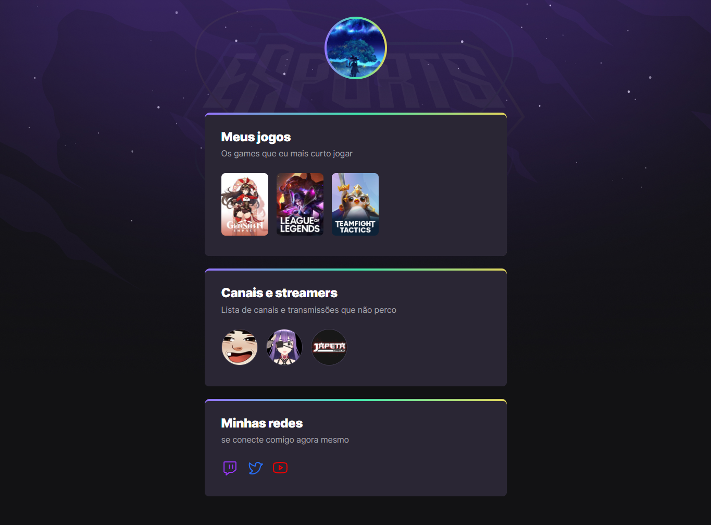

# NLW eSports 

> Trilha Explorer

Projeto contruido no evento Next Level Week da Rocketseat.

 > 🔗 [Clique aqui para acessar](https://matheusvs0.github.io/NLW-esports-Explorer)

## 🖥️ Tecnologias 

- HTML
- CSS
- Git e Github

## 📚 O que aprendi

Meu primeiro projeto utilizando HTML e CSS, e com a ajuda da semana Next Level da Rocketseat consegui fazer esse site.
Aprendi noções básicas sobre HTML e CSS e como importar o projeto para o Github.

## 📧 Contato

matheusvini2408@gmail.com